# WAPH-Web Application Programming and Hacking

## Instructor: Dr. Phu Phung

**Name**: Naga Chetan Pidugu

**Email**: pidugunn@ucmail.uc.edu

## Repository URL

Respository's URL: [https://github.com/pidugunn/pidugunn.github.io](https://github.com/pidugunn/pidugunn.github.io)

Website URL : [https://pidugunn.github.io/index.html](https://pidugunn.github.io/index.html)

Course Outcomes URL : [https://pidugunn.github.io/waph.html](https://pidugunn.github.io/waph.html)

# Project 1 - Front-end Web Development on github.io cloud service with a Professional Profile Website.

## Overview and Requirements 

- In the project 1 I have learnt how to build a web page from the scratch.
- I have learnt how to use open source bootstrap from w3 schools.
- I have made my own portfolio website that is targeted to specific company.
- I have revised my knowledge by adding analog, digital clock, show email js to the website.
- I learnt about the API integration and integrated joke API changes every 1 min and weather API that displays temperature and description.
- I got to know about the usage of cookies using simple javascript.

## Section 1 - General Requirements 

- Created the repository named pidugunn.github.io and added index.html file.
- After looking into the examples given by professor I have chosen this website "https://www.w3schools.com/bootstrap/bootstrap_theme_company.asp".
- I have made changes to my website accordingly added About, education, experiences, project, Targeted company, link to the WAPH course and contact details.
- I have also include my headshot using basic css stying.

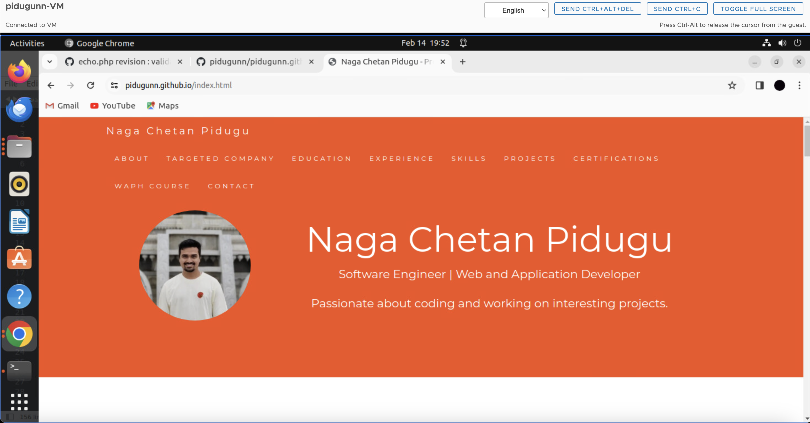

- Added the course link used href tag and added in the navigation bar WAPH COURSE and directs it to the course learnings and labs we have done.

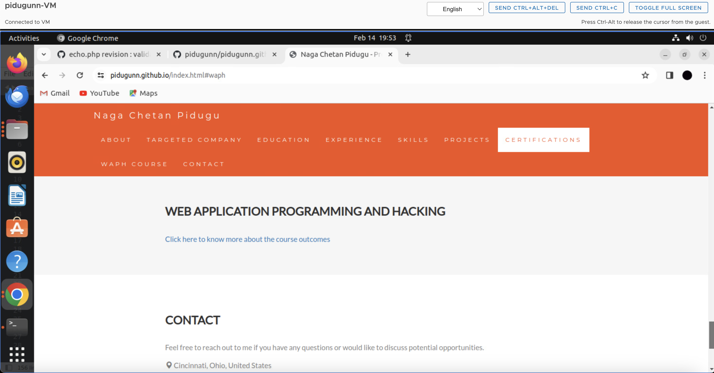

## Section 2 - Non Technical Requirements

- I have used open source bootstrap as mentioned in the class https://www.w3schools.com/bootstrap/bootstrap_theme_company.asp.
- I have made the changes and added may details as in my resume added all my details in the navigation bar at the top.
- Included the page tacker https://analytics.withgoogle.com/.
- Created the analytics account given my link and added the code snippet to my index.html page.
- After the inclusion I tested it and the user count increased !

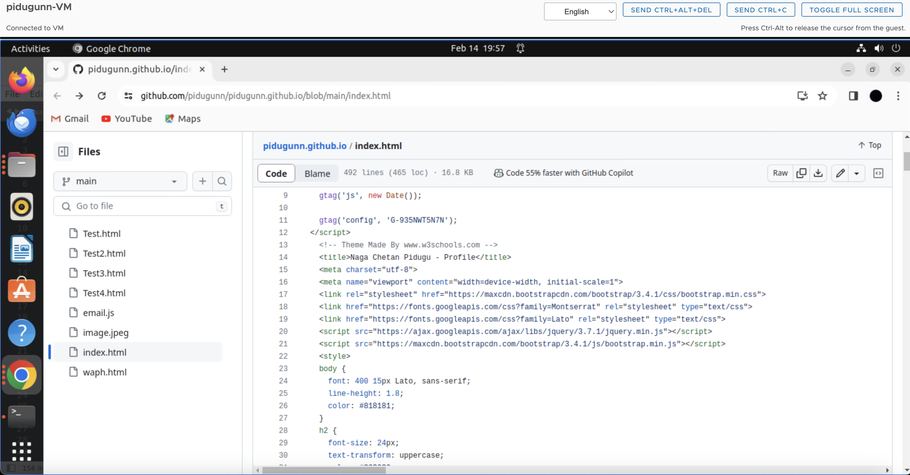

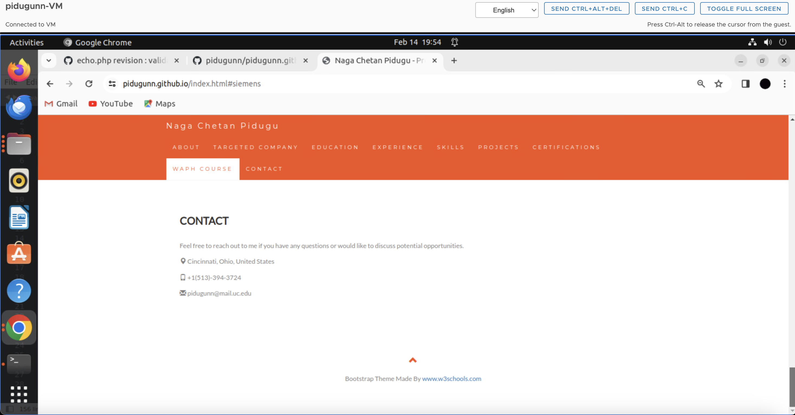

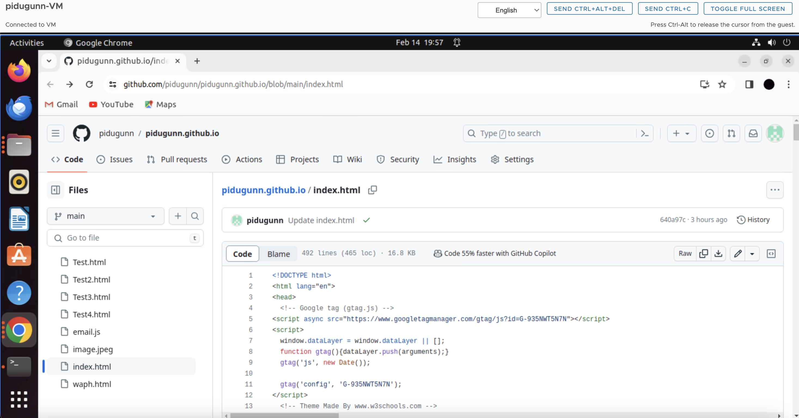

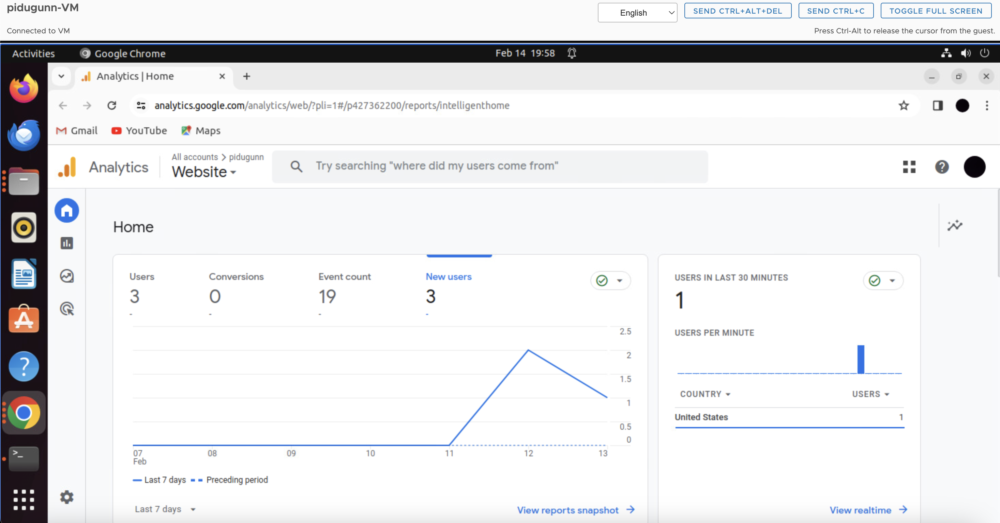

## Section 3 - Technical Requirements

- When it comes to the usage of jQuery I took the examples from the lab2 itself I added the files into to new file waph.html because not to confuse between my profile and course work but I included the link in my profile page.
- For jQuery to fetch the API of the jokes and display them on website.
- For the other frame work I have used Angular to display a simple message in the that displays "Hello from angular JS".
- I have used angular to display the digital clock the code is attached below with the screenshot.
- I have added the digital clock, analog clock, show email javascripts additionally I added the CSS template we used in the lab2.

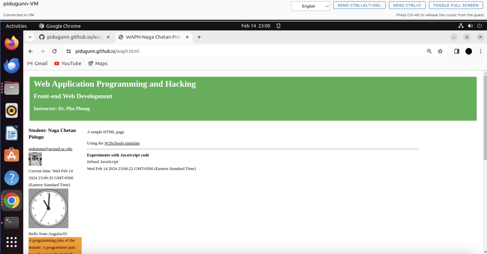

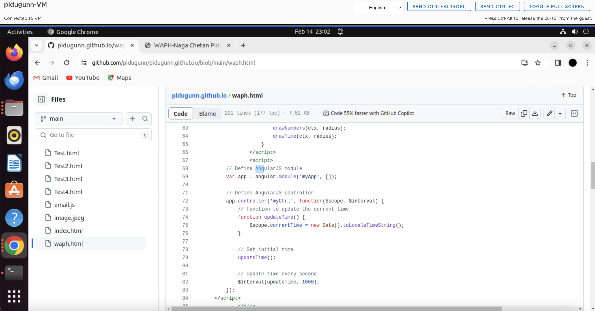

- I have written the script for the JOKE API in jQuery and set the time limit to 60000ms that is 1 min that changes the code and call the function without refreshing the page.

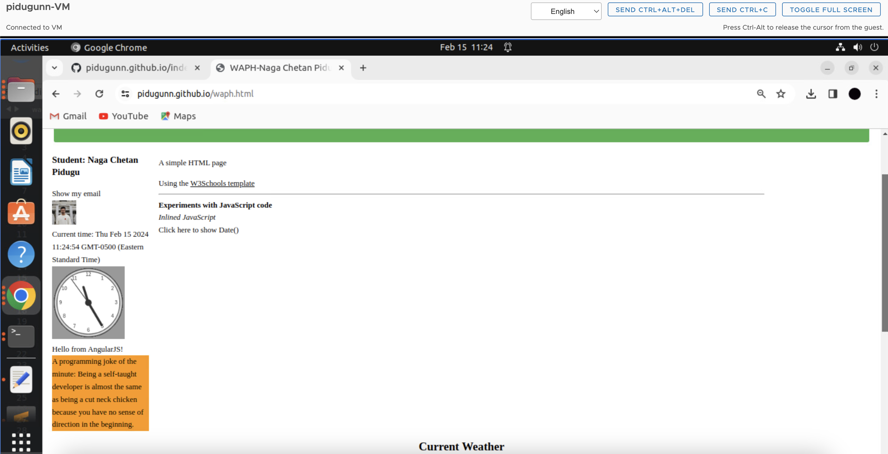

- After 1 min I took second screenshot without refreshing the page.

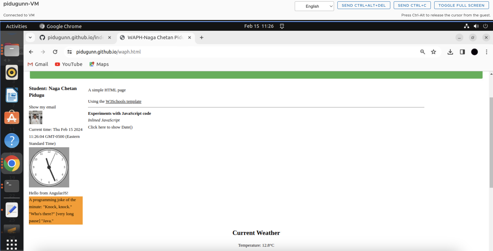

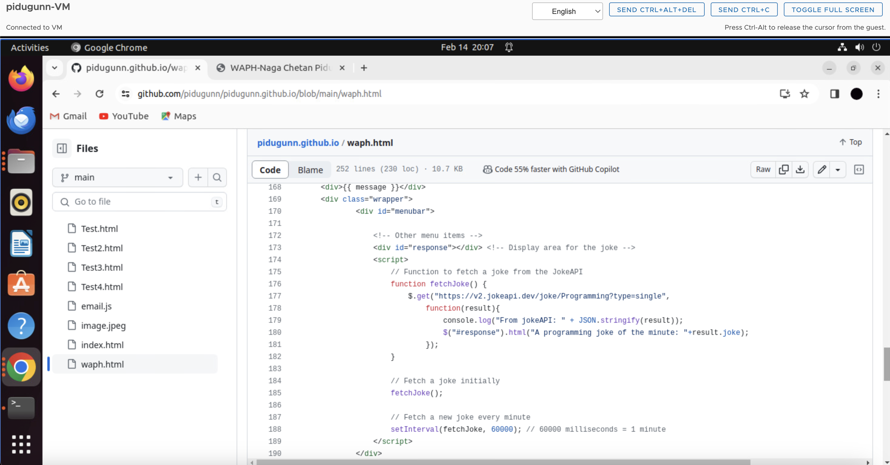

- With the API integration of the graphics part it is fun to do. Firstly I have chosen weather API I signup for the website.
- After logging in I had to search for an API code and paste it the code in my html file.
- Then I created 3 variables weather data, temperature and description and aligned it to the center in the styling section.
- I have given the city as Cincinnati.

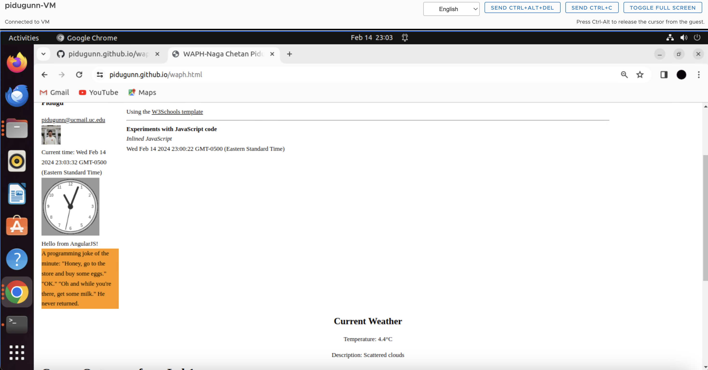

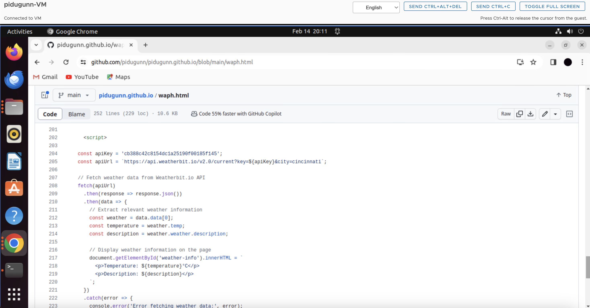

## Java Script code to remember the cookies.

- Firstly I have taken some time to understand the code snippet given by the professor in class.

- Later I added the function to remember the date time and display them like an alert message.
- If the user is clicking the link for the first time then the alert msg say Welcome to my homepage!
- If the user tries to log into the link once again it shows welcome back with the time and date.
- All the data of the cookie are stored in a sub strip in the java script file. This allows the browser to remember how many times the user clicked the link.

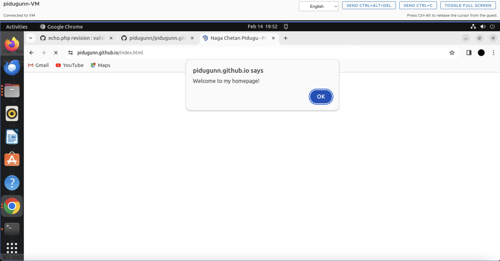

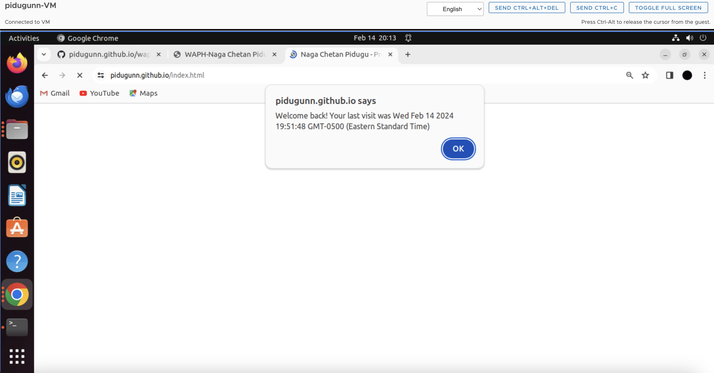

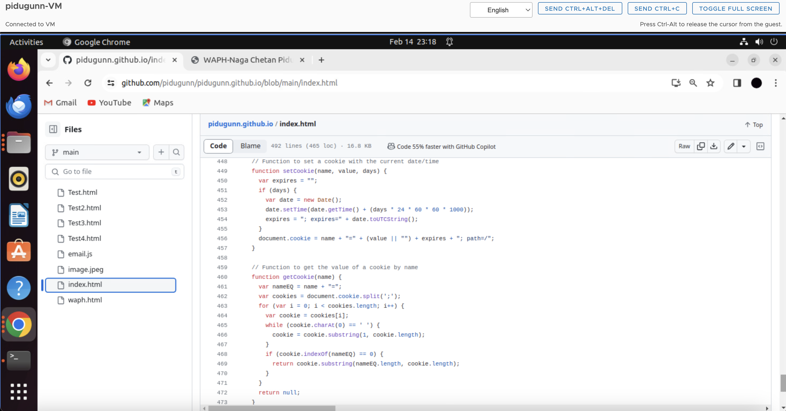

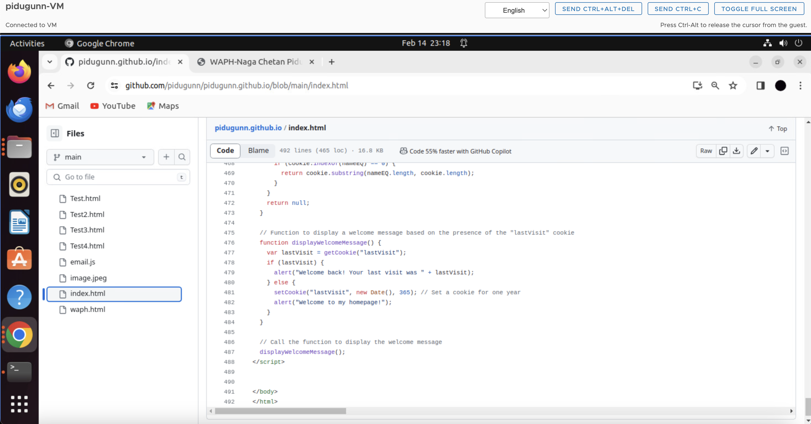

